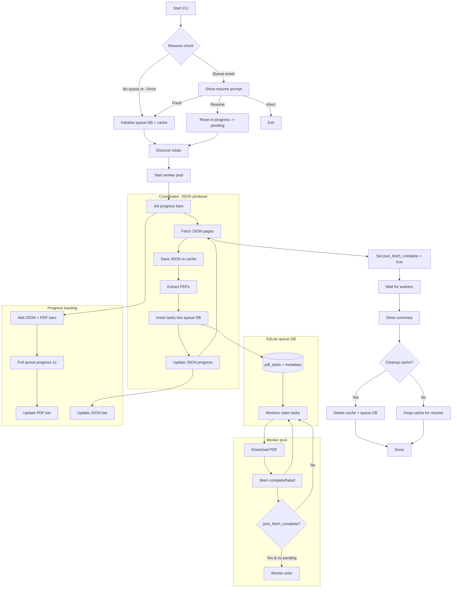

# EF-DL: Epstein Files Downloader

```
 ______     ______   _____     __
/\  ___\   /\  ___\ /\  __-.  /\ \
\ \  __\   \ \  __\ \ \ \/\ \ \ \ \____
 \ \_____\  \ \_\    \ \____-  \ \_____\
  \/_____/   \/_/     \/____/   \/_____/
```

> **DISCLAIMER**: This application is for **EDUCATIONAL PURPOSES ONLY**. By using this tool, you consent that you are 18 years of age or older and will use responsibly.

Currently the DOJ search portal is very limited and requires a lot of manual intervention. EF-DL is designed to automate this process and remove the friction of downloading files.

EF-DL is an interactive CLI tool that automates the process of downloading files with support for search term, parallel downloads (up to 10 workers), pagination, prefixes, deduplication and more.

The aim of EF-DL is to help expedite the processing of the public epstein files by downloading live up-to-date files and ultimately enable batch postprocessing of the documents. (i.e. ai models to search through files).

<div align="center">

</div>

## Table of Contents

<details>
<summary>View TOC:</summary>

- [Features](#features)
- [Installation](#installation)
  - [Option 1: Docker (Recommended)](#option-1-docker-recommended)
  - [Option 2: Bun Package Manager](#option-2-bun-package-manager)
  - [Option 3: Local Development](#option-3-local-development)
- [Quick Start](#quick-start)
  - [Start with interactive mode (default)](#start-with-interactive-mode-default)
  - [Download all pages](#download-all-pages)
  - [Download a specific page](#download-a-specific-page)
  - [Interactive mode with pre-filled values](#interactive-mode-with-pre-filled-values)
- [Docker Usage](#docker-usage)
  - [Quick Start with Docker](#quick-start-with-docker)
  - [Docker Commands](#docker-commands)
- [Usage](#usage)
  - [Command Line Options](#command-line-options)
  - [Interactive Mode](#interactive-mode)
  - [Examples](#examples)
- [Download Flow](#download-flow)
- [File Organization](#file-organization)
- [Tech Stack](#tech-stack)
- [Development](#development)
- [Important Notes](#important-notes)
- [Contributing](#contributing)
- [License](#license)

</details>

## Features

- **Live Up-To-Date Downloads**: Fetches the latest files directly from the DOJ portal in real-time (no reliance on outdated or torrented datasets)
- **Search Portal Integration**: Download by search term from the justice.gov Epstein Files portal
- **PDF Downloads**: Downloads Files/PDFs with automatic deduplication based on filename and file size
- **Progress Tracking**: Visual progress bars for JSON fetching and PDF downloads
- **Parallel Workers**: Multi-process downloads with a queue-backed resume system (up to 10 parallel workers)
- **Resume Support**: Restart interrupted runs from the queue state
- **Prefix Modes**: Choose no prefix, page-number prefixes, or custom prefixes
- **Smart Deduplication**: Detects existing files and skips/renames them appropriately
- **Batch Processing**: Download single pages or all pages at once
- **Interactive Mode**: Guided prompts for configuration (great for first-time users)
- **Age Verification**: Built-in age consent for legal compliance (By using this tool you verify you are 18+)
- **Security Handling**: No manual intervention per download. Automatically handles CAPTCHA, age, and verification challenges

## Installation

> **Bun Runtime Required**: This package uses Bun-specific APIs (`bun:sqlite`) and requires the Bun runtime. It will not work with Node.js.

### Option 1: Docker (Recommended)

No local runtime installation needed - just Docker:

- [Docker](https://www.docker.com/) v20.0.0 or higher
- [Docker Compose](https://docs.docker.com/compose/) v2.0.0 or higher (optional)

Docker Images:

- Docker Hub: `iammorpheus/ef-dl:latest`
- GitHub Container Registry: `ghcr.io/iammorpheuszion/ef-dl:latest`

```bash
# Option A: Using docker-compose (recommended)
# Download & run docker-compose.yml
curl -O https://raw.githubusercontent.com/iammorpheuszion/epstein-files-downloader-cli-efdl/main/docker-compose.yml

docker compose run -it --rm ef-dl
```

```
# Option B: Using docker run directly
# Configure download location with -v flag
docker run -it --rm -v ./downloads:/app/downloads iammorpheus/ef-dl
```

See [Docker Usage](#docker-usage) for more details.

### Option 2: Bun Package Manager

Install from npm using Bun:

```bash
# Using bunx (no installation needed) - like npx but for Bun
bunx ef-dl --age true -s "your search term" -d ./downloads

# Or install globally with Bun
bun install -g ef-dl
ef-dl --age true -s "your search term" -d ./downloads
```

### Option 3: Local Development

Clone and run from source:

<details>
<summary>Local installation steps</summary>

**Prerequisites:** [Bun](https://bun.sh/) v1.0.0 or higher

1. Clone the repository:

```bash
git clone https://github.com/iammorpheuszion/ef-dl.git
cd ef-dl
```

2. Install dependencies:

```bash
bun install
```

3. Verify installation:

```bash
bun run typecheck
```

</details>

## Quick Start

### Start with interactive mode (default)

Running without arguments automatically starts interactive mode:

```bash
bun start --age true
```

### Interactive mode with pre-filled values

```bash
bun start --age true -i -s "your search term" -p 5
```

### Download all pages

```bash
bun start --age true -s "your search term" -d ./downloads
```

### Download a specific page

```bash
bun start --age true -s "your search term" -p 5 -d ./downloads
```

## Usage

### Command Line Options

| Flag            | Short | Description                               | Required | Default   |
| --------------- | ----- | ----------------------------------------- | -------- | --------- |
| `--age`         | -     | Confirm you are 18+ (true/false)          | No       | -         |
| `--search`      | `-s`  | Search term to query the portal           | Yes      | -         |
| `--directory`   | `-d`  | Download directory path                   | Yes      | -         |
| `--page`        | `-p`  | Page number to download                   | -        | All pages |
| `--all`         | `-a`  | Download all pages from specified page    | -        | `false`   |
| `--prefix-mode` | -     | Prefix mode: none, page, custom           | -        | `none`    |
| `--prefix`      | -     | Custom filename prefix (requires custom)  | -        | -         |
| `--workers`     | `-w`  | Number of parallel workers (1-10)         | -        | `4`       |
| `--cache`       | `-c`  | Keep cache for this search (true/false)   | -        | `false`   |
| `--verbose`     | `-v`  | Enable verbose debug output               | -        | `false`   |
| `--interactive` | `-i`  | Interactive mode with prompts             | -        | `false`   |
| `--force`       | `-f`  | Force fresh start, ignore resume          | -        | `false`   |
| `--sequential`  | -     | Use sequential download (disable workers) | -        | `false`   |
| `--help`        | `-h`  | Show help menu                            | -        | -         |
| `--version`     | `-V`  | Show version number                       | -        | -         |

### Interactive Mode

Interactive mode provides guided prompts for all configuration options. **Running the tool without any arguments automatically enters interactive mode.**

```bash
# Start interactive mode (no arguments needed)
bun start

# Explicit interactive mode
bun start -i

# Interactive with pre-filled values
bun start -i --age true -s "your search term" -d ./downloads -p 1
```

**Interactive prompts:**

1. Age confirmation
2. Search term
3. Download directory
4. Page number (leave empty for all pages)
5. Download mode (single page or all from page)
6. Filename prefix (none, page number, or custom)
7. Number of workers
8. Verbose mode (yes/no)
9. Cache cleanup (prompt after download)

### Step-by-Step Prefill Examples

Each command adds one more flag to prefill the interactive prompts:

| Step | What it adds | Command |
| ---- | ----------- | ------- |
| 1 | Interactive mode | `bun start` |
| 2 | Interactive mode (explicit) | `bun start -i` |
| 3 | Prefill age check | `bun start --age true` |
| 4 | Prefill search | `bun start --age true -s "your search term"` |
| 5 | Prefill directory | `bun start --age true -s "your search term" -d ./downloads` |
| 6 | Prefill cache (true = keep, false = delete) | `bun start --age true -s "your search term" -d ./downloads -c false` |
| 7 | Prefill page (single page) | `bun start --age true -s "your search term" -d ./downloads -p 1` |
| 8 | Prefill range (from page) | `bun start --age true -s "your search term" -d ./downloads -p 1 -a` |
| 9 | Prefill prefix mode (page) | `bun start --age true -s "your search term" -d ./downloads --prefix-mode page` |
| 10 | Prefill prefix mode (custom) | `bun start --age true -s "your search term" -d ./downloads --prefix-mode custom --prefix EPSTEIN` |
| 11 | Prefill workers | `bun start --age true -s "your search term" -d ./downloads -w 10` |
| 12 | Prefill verbose | `bun start --age true -s "your search term" -d ./downloads -v` |
| 13 | Prefill force (fresh start) | `bun start --age true -s "your search term" -d ./downloads -f` |
| 14 | Sequential mode | `bun start --age true -s "your search term" -d ./downloads --sequential` |

### Non-Interactive Mode (No Prompts)

If you want to bypass all prompts, pass the minimum required flags plus any optional flags you want to fix:

**Minimum to avoid prompts**

- `--age true` (skips the age prompt)
- `-s, --search <term>`
- `-d, --directory <path>` (unless `USE_DEFAULT_DIR=true`)
- `-c, --cache <true|false>` (skips the cleanup prompt at the end)

Example (uses defaults for workers, prefix mode, etc):

```bash
bun start --age true -s "your search term" -p 1 -d ./downloads -c false
```

What this does:

- Skips the age prompt and starts immediately
- Downloads page 1 only (no `-a`, so single page)
- Uses default workers/prefix settings
- Deletes the cache for that search term at the end (`-c false`)

Example (customize more defaults):

```bash
bun start --age true -s "your search term" -p 1 -d ./downloads -w 10 -c true
```

What this does:

- Uses 10 workers
- Keeps the cache for resume (`-c true`)

**Missing required flags = interactive fallback**

If you omit required flags (like `-s` or `-d`), the CLI will fall back to interactive mode and prefill the prompts with any flags you did provide. You can then accept or change those values and supply the missing ones.

### Examples

<details>
<summary>Click to see all example commands</summary>

```bash
# Download all pages with parallel workers (default: 4)
bun start --age true -s "your search term" -d ./downloads

# Download with 10 parallel workers
bun start --age true -s "your search term" -d ./downloads --workers 10

# Download with sequential mode (no parallelism)
bun start --age true -s "your search term" -d ./downloads --sequential

# Download only page 5
bun start --age true -s "your search term" -p 5 -d ./downloads

# Download all pages starting from page 5
bun start --age true -s "your search term" -p 5 -a -d ./downloads

# Download page 5 with page-number prefix
bun start --age true -s "your search term" -p 5 -d ./downloads --prefix-mode page
# Results in: 5-EFTA00000001.pdf

# Download with custom prefix
bun start --age true -s "your search term" -p 5 -d ./downloads --prefix-mode custom --prefix EPSTEIN
# Results in: EPSTEIN-EFTA00000001.pdf

# Download with verbose output
bun start --age true -s "your search term" -d ./downloads -v

# Force fresh start (ignore previous resume)
bun start --age true -s "your search term" -d ./downloads --force

# Interactive mode (prompts for all options)
bun start --age true -i

# Interactive mode with pre-filled values
bun start --age true -i -s "your search term" -d ./downloads
```

</details>

## Docker Usage

You can also run EF-DL using Docker without installing Bun or Node.js locally.

### Quick Start with Docker

```bash
# Run in interactive mode
docker compose run -it --rm ef-dl --age true

# Download specific search term
docker compose run -it --rm ef-dl bun index.ts --age true -s "your search term" -d ./downloads
```

### Docker Commands

**Volume Binding:** Use `-v` to map a local directory to the container's download location. Downloads will be saved to your local machine.

<details>
<summary>Click to see all example commands</summary>

```bash
# Build the image
docker build -t ef-dl .

# Run interactively - downloads go to ./downloads on your machine
docker run -it --rm -v $(pwd)/downloads:/app/downloads ef-dl --age true

# Run with arguments - save to current directory
docker run -it --rm -v $(pwd)/downloads:/app/downloads ef-dl bun index.ts --age true -s "your_search_term" -d ./downloads

# Custom download location - use absolute path
docker run -it --rm -v /path/to/your/downloads:/app/downloads ef-dl bun index.ts --age true -s "your_search_term" -d ./downloads

# Windows users (PowerShell)
docker run -it --rm -v ${PWD}/downloads:/app/downloads ef-dl --age true

# Use production-optimized image
docker build -f Dockerfile.production -t ef-dl:prod .
docker run -it --rm -v $(pwd)/downloads:/app/downloads ef-dl:prod --age true
```

</details>

## Download Flow

Parallel mode (default) uses a producer-consumer pipeline with a SQLite queue and worker pool. Use `--sequential` to run the legacy single-process flow.
The coordinator runs in the main process; the worker count only controls the number of worker processes (total processes = 1 coordinator + N workers).

<details>
<summary>View detailed flow diagram</summary>



</details>

## File Organization

**JSON Metadata:** Automatically saved with search results, document metadata, URLs, file sizes, and excerpts.

**PDF Files:** Prefix mode defaults to none (e.g., `filename.pdf`). Use `--prefix-mode page` or `--prefix-mode custom` to add prefixes. Duplicate detection based on filename AND file size.

<details>
<summary>View directory structures</summary>

### Parallel mode (default)

```
{download-directory}/
├── cache/
│   └── {search-term}/
│       ├── json/
│       │   ├── search-{term}-page-1-{timestamp}.json
│       │   ├── search-{term}-page-2-{timestamp}.json
│       │   └── ...
│       └── {search-term}.db
└── files/
  └── {search-term}/
    ├── {page}-EFTA00000001.pdf (when using --prefix-mode page)
    ├── {page}-EFTA00000002.pdf (when using --prefix-mode page)
    └── ...
```

### Sequential mode (`--sequential`)

```
{download-directory}/
└── {search-term}/
  ├── json/
  │   ├── search-{term}-page-1-{timestamp}.json
  │   ├── search-{term}-page-2-{timestamp}.json
  │   └── ...
  └── pdfs/
    ├── {prefix}-EFTA00000001.pdf
    ├── {prefix}-EFTA00000002.pdf
    └── ...
```

</details>

## Tech Stack

**Core:** TypeScript, Bun/Node.js, Puppeteer for browser automation

<details>
<summary>View all dependencies</summary>

### Dependencies

| Package               | Version  | Purpose                                         |
| --------------------- | -------- | ----------------------------------------------- |
| `@inquirer/prompts`   | ^8.2.0   | Interactive CLI prompts and user input handling |
| `browserless`         | ^10.9.18 | Headless browser automation for web scraping    |
| `chalk`               | ^5.6.2   | Terminal string styling and colors              |
| `commander`           | ^14.0.3  | CLI argument parsing and command structure      |
| `figlet`              | ^1.10.0  | ASCII art text generation for headers           |
| `multi-progress-bars` | ^5.0.3   | Multiple concurrent progress bar display        |
| `puppeteer`           | ^24.36.1 | Browser automation and PDF downloads            |

### Development Dependencies

| Package         | Version | Purpose                                     |
| --------------- | ------- | ------------------------------------------- |
| `@types/bun`    | latest  | TypeScript type definitions for Bun runtime |
| `@types/figlet` | ^1.7.0  | TypeScript type definitions for Figlet      |

</details>

## Development

<details>
<summary>Scripts and project structure</summary>

### Scripts

| Script         | Command                            | Description              |
| -------------- | ---------------------------------- | ------------------------ |
| `dev`          | `bun --watch --hot index.ts`       | Run with hot reloading   |
| `start`        | `bun index.ts`                     | Run the application      |
| `build`        | `bun build index.ts --outdir dist` | Build for production     |
| `typecheck`    | `tsc --noEmit`                     | TypeScript type checking |
| `test:browser` | `bun src/browser-client.ts`        | Test browser client      |

### Project Structure

```
ef-dl/
├── index.ts                 # Main application entry point
├── src/
│   ├── browser-client.ts    # Web scraping and PDF download logic
│   ├── progress.ts          # Progress bar management
│   ├── types/
│   │   ├── enums.ts          # Shared enums (prompt types)
│   │   └── browserless.d.ts  # Browserless module typings
│   ├── utils/
│   │   ├── ascii.ts          # ASCII art header generation
│   │   ├── logger.ts         # Centralized logging utilities
│   │   └── prompt.ts         # Unified prompt handling
│   └── workers/
│       ├── coordinator.ts    # Producer logic
│       ├── task-queue.ts     # SQLite operations
│       ├── worker-pool.ts    # Worker management
│       ├── worker.ts         # Worker process
│       └── types.ts          # Worker types
├── downloads/                # Default download directory (created on first run)
├── package.json
├── tsconfig.json
└── README.md
```

</details>

## Important Notes

- **Age Requirement**: You must be 18+ to use this application
- **Educational Use**: For educational purposes only
- **Default Behavior**: Running without arguments starts interactive mode
- **Parallel by Default**: Worker pipeline is default; use `--sequential` for single-process
- **File Deduplication**: Detected by filename AND size to prevent duplicates

<details>
<summary>Troubleshooting</summary>

### "required option not specified" error

This error only occurs in non-interactive mode. Either:

- Run without arguments to use interactive mode: `bun index.ts`
- Provide all required flags: `bun index.ts -s "term" -d ./downloads`
- Use interactive mode explicitly: `bun index.ts -i`

### Download fails

- Check your internet connection
- Try with `-v` (verbose) flag to see detailed error messages
- Ensure you have sufficient disk space

### Files not being detected as duplicates

The tool checks both filename AND file size. If a file exists with a different size, it will be re-downloaded.

</details>

## Contributing

Contributions are welcome. Please feel free to submit a Pull Request.

## License

[](https://opensource.org/licenses/MIT)

This project is licensed under the MIT License - see the [LICENSE](LICENSE) file for details.

---

**Disclaimer**: This is an independent educational tool and is not affiliated with or endorsed by the US Department of Justice. Use responsibly and in accordance with all applicable laws and terms of service.
